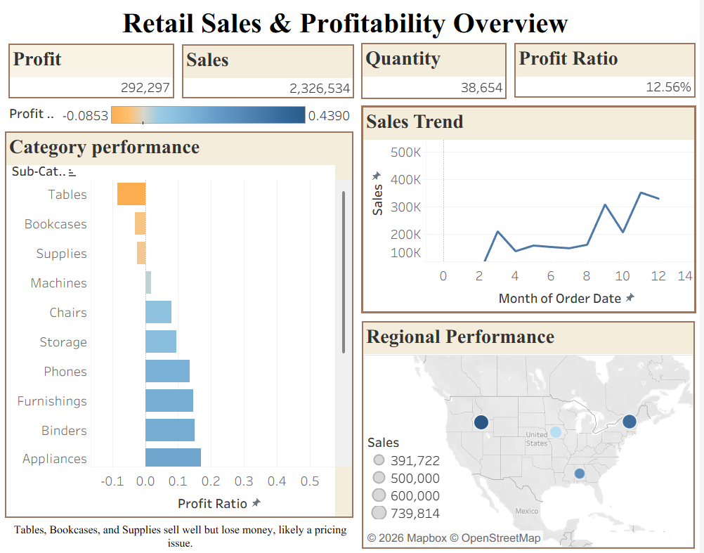

# Retail Sales & Profitability Dashboard (Tableau)

An interactive Tableau dashboard analyzing sales, profit, and regional performance using the Sample-Superstore dataset, built to identify where strong sales volume is masking weak profit margins.

## Key Insight

**Tables, Bookcases, and Supplies sell well but lose money, likely a pricing issue.**

Despite solid sales volume, these three sub-categories post negative profit ratios (down to -0.0853), while categories like Appliances, Binders, and Furnishings post healthy positive margins. This points to a pricing or discounting strategy that may need review for the underperforming lines.

## What's in the Dashboard

- **KPI Overview:** Total Sales ($2,326,534), Profit ($292,297), Quantity (38,654 units), and overall Profit Ratio (12.56%)
- **Sales Trend:** Monthly sales trend showing seasonal peaks in September and November-December
- **Category Performance:** Sub-categories ranked by profit ratio (lowest to highest), color-coded to instantly surface which product lines are losing money despite sales volume
- **Regional Performance:** A US map sizing markets by sales volume and coloring by profit ratio, highlighting which regions combine strong sales with strong (or weak) margins

## Tools Used

Tableau Desktop · Sample-Superstore dataset

## Screenshots

## Why This Project

Built to demonstrate dashboard design and data storytelling skills for data analytics roles, translating raw sales data into a clear, actionable business finding rather than just a collection of charts.
